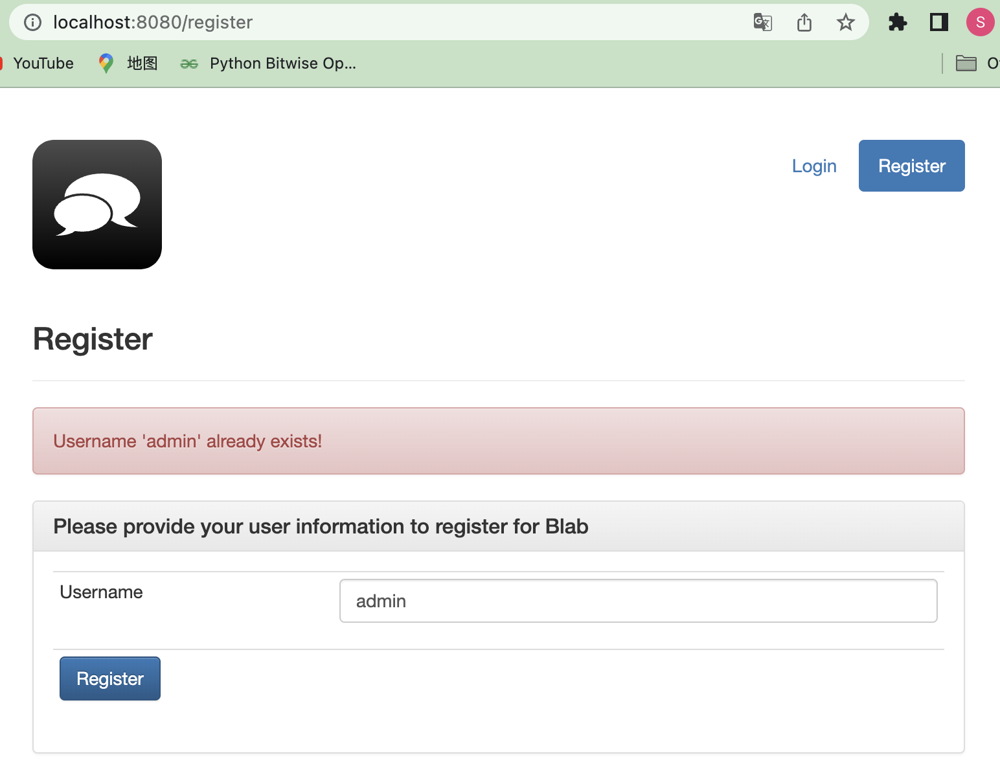
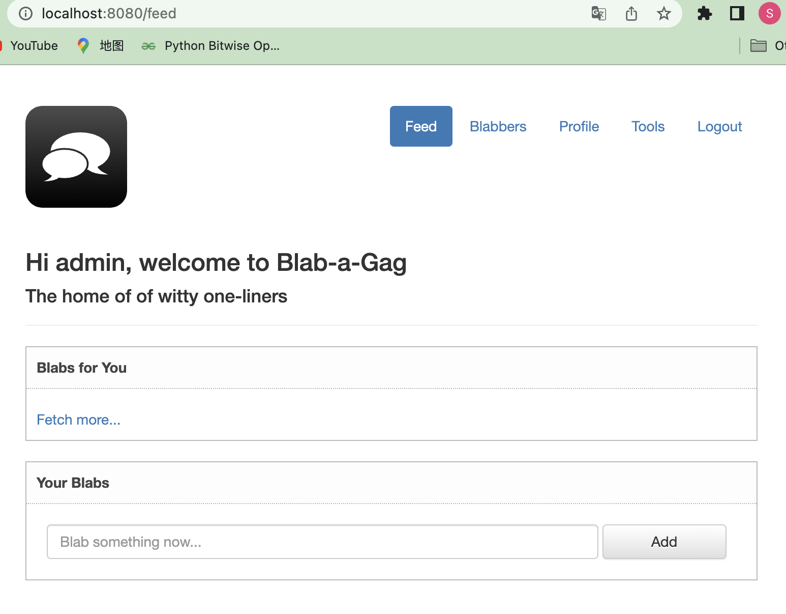
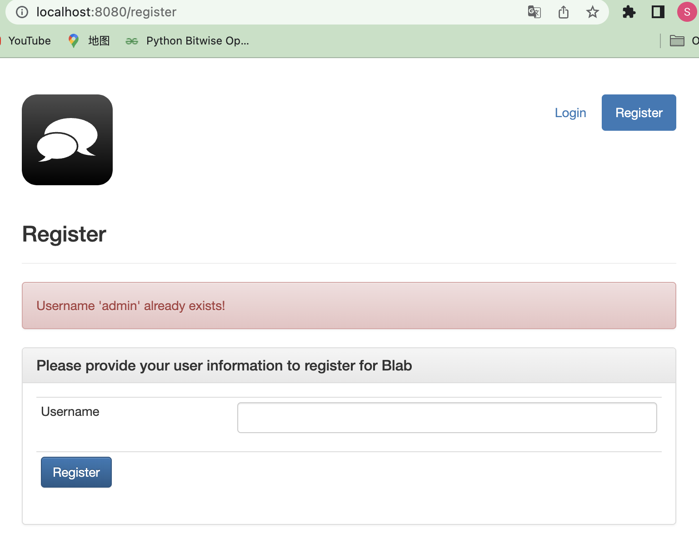
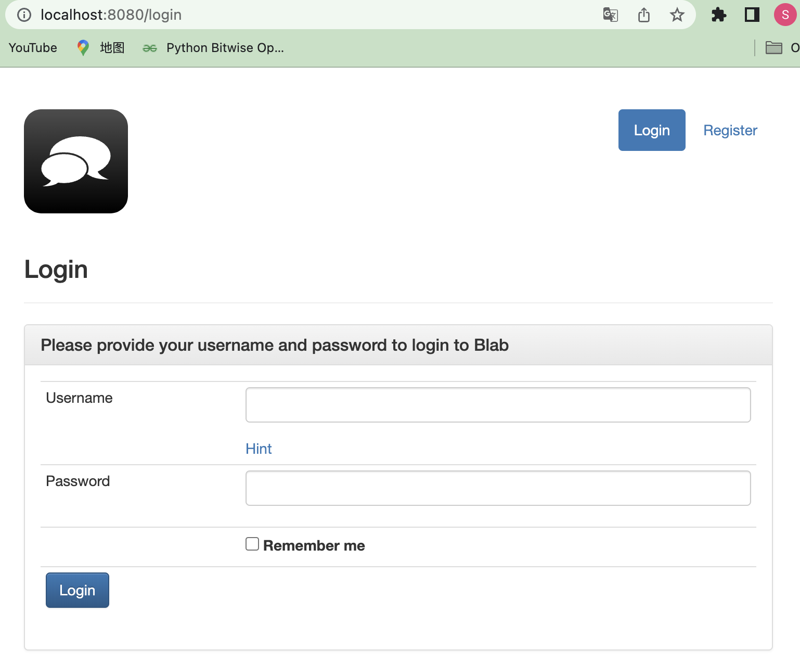
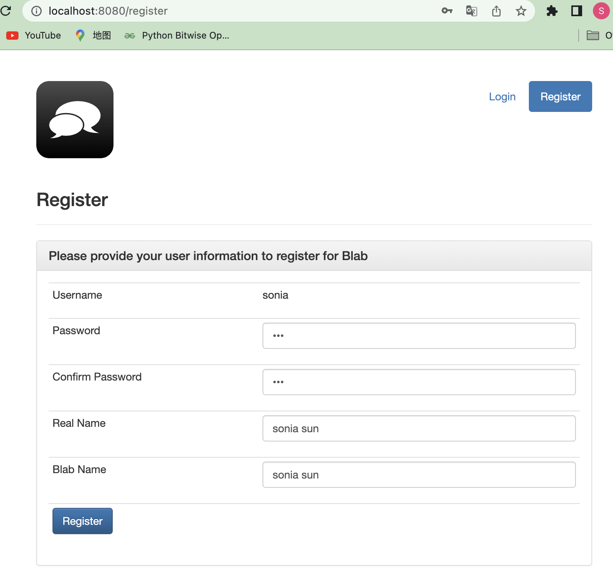
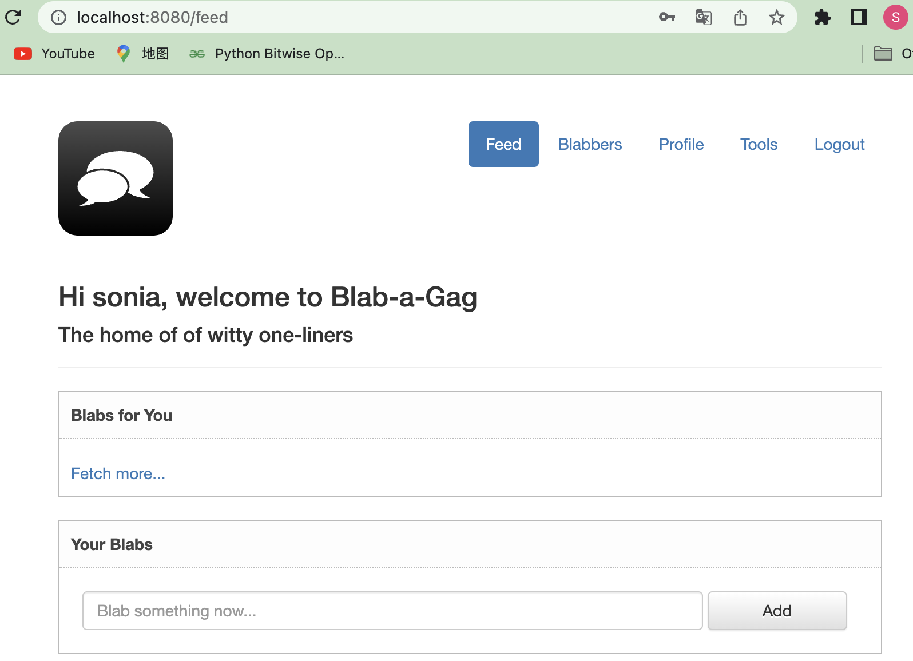
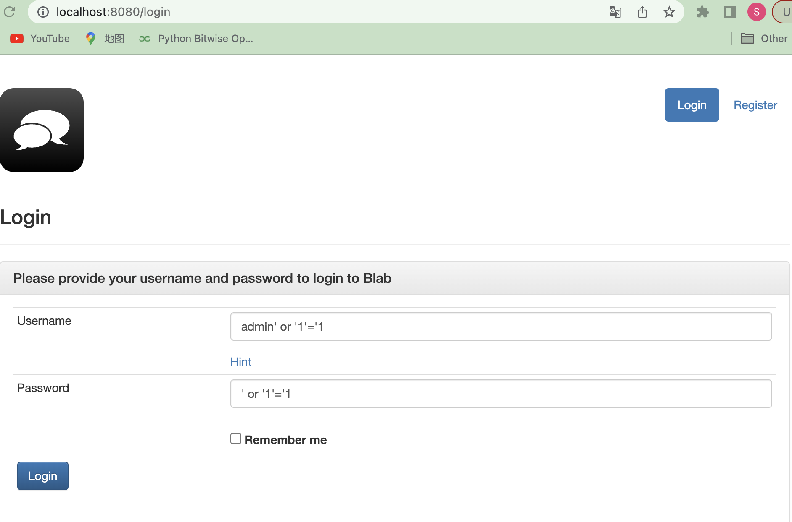
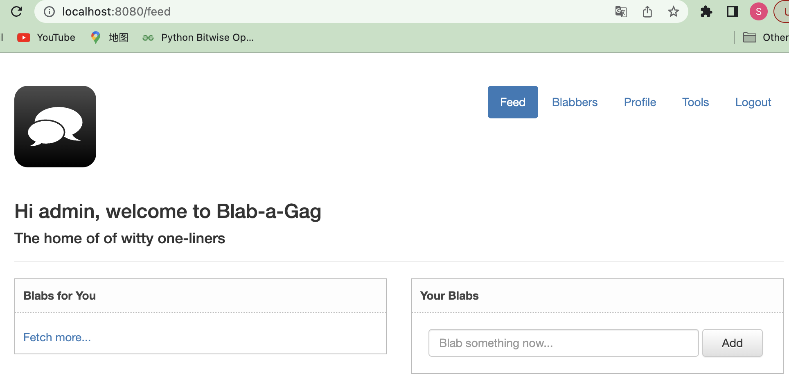
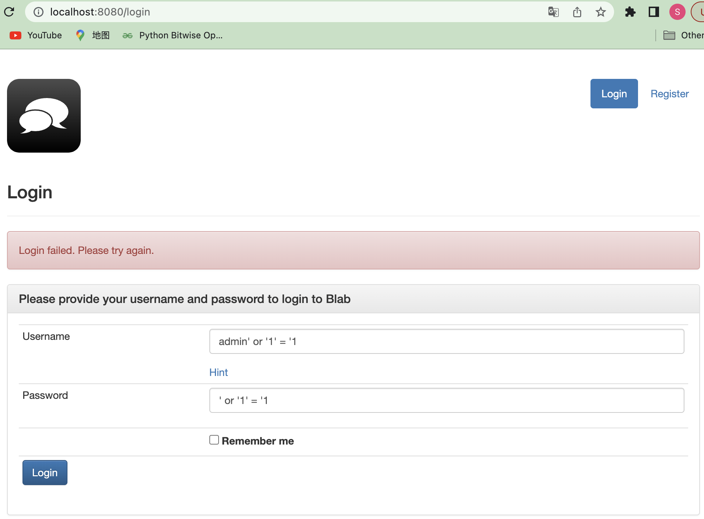

# Weaknesses and Vulnerabilities Lab - Java

Fengnan Sun, fengnans@uci.edu, [Github](https://github.com/SoniaSun810)

**Table of Contents**
+ [1.CWE-501: Trust Boundary Violation](#1-cwe-501-trust-boundary-violation)
    + [1.1 Explanation of the vulnerability](#11-explanation-of-the-vulnerability)
    + [1.2 Impact of successful exploitation](#12-impact-of-successful-exploitation)
    + [1.3 Exploitation demonstration](#13-exploitation-demonstration)
    + [1.4 Mitigation](#14-mitigation)
      + [1.4.1 Source code analysis](#141-source-code-analysis)
      + [1.4.2 Code changes to mitigate the vulnerability](#142-code-changes-to-mitigate-the-vulnerability)
      + [1.4.3 Post-mitigation demonstration](#143-post-mitigation-demonstration)
      + [1.4.4 Remediate](#144-remediate)
+ [2.CWE-89:  SQL Injection](#2-cwe-89--sql-injection)
    + [2.1 Explanation of the vulnerability](#21-explanation-of-the-vulnerability)
    + [2.2 Impact of successful exploitation](#22-impact-of-successful-exploitation)
    + [2.3 Exploitation demonstration](#23-exploitation-demonstration)
    + [2.4 Mitigation](#24-mitigation)
        + [2.4.1 Source code analysis](#241-source-code-analysis)
        + [2.4.2 Code changes to mitigate the vulnerability](#242-code-changes-to-mitigate-the-vulnerability)
        + [1.4.3 Post-mitigation demonstration](#243-post-mitigation-demonstration)


----
<p style="page-break-after:always"></p>

The [veracode/verademo](https://github.com/YuqiHuai/verademo) application showcases various **security vulnerabilities**, such as SQL injection, cross-site scripting (XSS), insecure direct object references, and others. The purpose of this application is to provide a hands-on learning experience for developers, security professionals, and students, demonstrating how common vulnerabilities can be exploited and mitigated in real-world scenarios.

By exploring and interacting with the Verademo application, users can gain a deeper understanding of how vulnerabilities manifest in applications and how to address them in their own projects. This knowledge can help improve the overall security of web applications and reduce the risk of security breaches.

My report focuses on **two distinct vulnerabilities**, which have been identified and examined separately. For each vulnerability, the report provides an in-depth explanation, discusses the potential consequences of successful exploitation, demonstrates the exploitation method, and outlines the mitigation steps taken. Additionally, the report includes a source code analysis highlighting the code changes made to address the vulnerabilities.

# 1. **CWE-501: Trust Boundary Violation**

## 1.1 Explanation of the vulnerability

Trust Boundary Violation is a security vulnerability that occurs when an application does not properly enforce boundaries between different components or layers with varying trust levels. 

In the VeraDemo application, a Trust Boundary Violation might occur if the application does not adequately check user permissions, validate input, or enforce access controls when data or functionality is transferred between different components or layers. 

The corresponding CWE for Trust Boundary Violation is **CWE-501**: Trust Boundary Violation. According to the CWE classification, this weakness occurs when an application moves data or functionality across a trust boundary without properly preserving the trust-related properties. As a result, the application may expose sensitive information, allow unauthorized actions, or enable attackers to escalate their privileges.

## 1.2 Impact of successful exploitation

If the Trust Boundary Violation vulnerability in VeraDemo is exploited, the consequences can be significant and vary depending on the specific implementation and context of the application. Some potential consequences include:

- Unauthorized access: Attackers could bypass access controls and gain unauthorized access to restricted areas, functionality, or data within the application. This might allow them to view, modify, or delete sensitive information that they shouldn't have access to.
- Data theft: Exploiting trust boundary violations could enable attackers to steal sensitive information, such as user credentials, personal data, or confidential business data.
- Privilege escalation: Attackers could exploit trust boundary violations to elevate their privileges within the application.
- Tampering with application data or functionality.

In our case, the user can log in as `admin` without registering.

## 1.3 Exploitation demonstration

- The **entry point is Login & Register Page**, go to `/register`
- Try to register for `admin`
- Note the error saying the user already exists
- Then click `Login`
- Note that you are logged in as `admin`, and the webpage will redirect to `/feed` directly





In the terminal, we can read the logger output in the terminal while doing this exploitation:

```java
INFO  VeraDemo:UserController - Entering processRegister
INFO  VeraDemo:UserController - Creating the Database connection
INFO  VeraDemo:UserController - User is already logged in - redirecting...
INFO  VeraDemo:BlabController - Entering showFeed
INFO  VeraDemo:BlabController - User is Logged In - continuing...
INFO  VeraDemo:BlabController - Getting Database connection
INFO  VeraDemo:BlabController - Preparing the BlabsForMe Prepared Statement
INFO  VeraDemo:BlabController - Executing the BlabsForMe Prepared Statement
INFO  VeraDemo:BlabController - Preparing the BlabsByMe Prepared Statement
INFO  VeraDemo:BlabController - Executing the BlabsByMe Prepared Statement
```

## 1.4 Mitigation

To mitigate this vulnerability, developers should implement proper input validation, and access controls, and ensure that trust-related properties are preserved when crossing trust boundaries.

### 1.4.1 Source code analysis

In function `processRegister` of Java class `app/src/main/java/com/veracode/verademo/controller/UserController.java`, refer to the code snippet and comments to locate where is the bug:

```java
@RequestMapping(value = "/register", method = RequestMethod.POST)
	public String processRegister(
			@RequestParam(value = "user") String username,
			HttpServletRequest httpRequest,
			HttpServletResponse httpResponse,
			Model model) {
		logger.info("Entering processRegister");

// Here is the problem, no matter Username is registered or not
// Always evoke Utils.setSessionUserName()
			Utils.setSessionUserName(httpRequest, httpResponse, username);

		logger.info("Creating the Database connection");
		try {
			Class.forName("com.mysql.jdbc.Driver");
			Connection connect = DriverManager.getConnection(Constants.create().getJdbcConnectionString());

			String sql = "SELECT username FROM users WHERE username = '" + username + "'";
			Statement statement = connect.createStatement();
			ResultSet result = statement.executeQuery(sql);
			if (result.first()) {
				model.addAttribute("error", "Username '" + username + "' already exists!");
				return "register";
			} else {
				return "register-finish";
			}
		} catch (SQLException | ClassNotFoundException ex) {
			logger.error(ex);
		}

		return "register";
	}
```

### 1.4.2 Code changes to mitigate the vulnerability

By only calling `Utils.setSessionUserName()` when a new user is to be registered, you ensure that the session is updated only when the registration process is successful. This approach helps prevent the Trust Boundary Violation issue, as the session will not be updated with a new username during an incomplete or failed registration process.

In Java class `app/src/main/java/com/veracode/verademo/controller/UserController.java`, refer to the modified code:

```java
@RequestMapping(value = "/register", method = RequestMethod.POST)
	public String processRegister(
			@RequestParam(value = "user") String username,
			HttpServletRequest httpRequest,
			HttpServletResponse httpResponse,
			Model model) {
		logger.info("Entering processRegister");

		// Get the Database Connection
		logger.info("Creating the Database connection");
		try {
			Class.forName("com.mysql.jdbc.Driver");
			Connection connect = DriverManager.getConnection(Constants.create().getJdbcConnectionString());

			String sql = "SELECT username FROM users WHERE username = '" + username + "'";
			Statement statement = connect.createStatement();
			ResultSet result = statement.executeQuery(sql);
			if (result.first()) {
				model.addAttribute("error", "Username '" + username + "' already exists!");
				return "register";
			} else {
// Only call Utils.setSessionUserName() when a new user is to registered
				Utils.setSessionUserName(httpRequest, httpResponse, username);
				return "register-finish";
			}
		} catch (SQLException | ClassNotFoundException ex) {
			logger.error(ex);
		}

		return "register";
	}
```

### 1.4.3 Post-mitigation demonstration

- Go to `/register`
- Try to register for `admin`
- Note the error saying the user already exists.
- Then click `Login`
- Note that the webpage will redirect to `/login`, the **Trust Boundary Violation** vulnerability is gone
- In the meantime, **the register and login functionality works fine**.





We can see that the register and login functionality works fine. 





### 1.4.4 Remediate

Create a new session upon login.

We can modify `setSessionUserName` method in Java class `app/src/main/java/com/veracode/verademo/utils/Utils.java` and set different attributes for `register` session and `login` session. 

```java
public static void setSessionUserName(HttpServletRequest request, HttpServletResponse response, String attributeName, String username) {
    request.getSession().setAttribute(attributeName, value);
		upgradeCookieSecurityForHttpsIfRequired(response);
}
```

# 2. **CWE-89:  SQL Injection**

## 2.1 Explanation of the vulnerability

- **Improper Neutralization of Special Elements used in an SQL Command**

The corresponding CWE for Trust Boundary Violation is **CWE-89：**Improper Neutralization of Special Elements used in an SQL Command ('SQL Injection') is a security vulnerability that occurs when an application fails to properly sanitize user input before using it in an SQL query. This can allow an attacker to inject malicious SQL code into the query, potentially leading to unauthorized access, data modification, or data disclosure.

In the context of VeraDemo, the vulnerability exists because the application constructs SQL queries by directly concatenating user-provided input (such as **`username`** and **`password`** in the example you provided) without proper sanitization or validation. This creates an opportunity for an attacker to craft input that includes SQL code, which will be executed by the database server when the query runs.

## 2.2 Impact of successful exploitation

Successful exploitation of the CWE-89: SQL Injection vulnerability in VeraDemo could lead to several severe consequences, including:

- **Unauthorized access:** An attacker could potentially bypass the application's authentication mechanisms by crafting malicious input, gaining unauthorized access to sensitive data, user accounts, or administrative functions.
- **Data theft**: An attacker could exploit the vulnerability to execute arbitrary SQL queries that read sensitive information from the database, such as user credentials, personal data, or financial details. This could lead to identity theft, fraud, or other forms of abuse.
- **Data modification or destruction**: Through SQL injection, an attacker might be able to modify, delete, or insert new records in the database. This could result in data loss, corruption, or manipulation, impacting the application's functionality and the integrity of the stored data.
- **Elevation of privileges**: If an attacker gains unauthorized access to an administrative account, they could potentially elevate their privileges within the application, enabling them to perform actions that they would not otherwise be authorized to do.
- **Compromise of the underlying system**: In some cases, a successful SQL injection attack can lead to the compromise of the underlying system hosting the database, allowing the attacker to execute commands or install malicious software on the server.

## 2.3 Exploitation demonstration

Normally, to gain access to an application with administrative privileges, we need to know the correct username and password, such as "admin" for both the username and password. However, with "SQL injection", attackers can exploit vulnerabilities in the application's code to bypass the authentication process without knowing the correct credentials.

By crafting malicious input that includes SQL code, an attacker can manipulate the application's SQL query to return true, even when the provided credentials are incorrect. For example: 

- Go to `/login`
- Enter `admin' or '1' = '1` for Username
- Enter `' or '1' = '1` for Password
- Then click `Login`
- Note that you are logged in as `admin`, without knowing the correct password





In the terminal, we can read the logger output in the terminal while doing this exploitation:

```java
INFO  VeraDemo:UserController - Entering processLogin
INFO  VeraDemo:UserController - Creating the Database connection
INFO  VeraDemo:UserController - Creating the Statement
INFO  VeraDemo:UserController - Execute the Statement
INFO  VeraDemo:UserController - User Found.
INFO  VeraDemo:UserController - Redirecting to view: redirect:profile
INFO  VeraDemo:UserController - Entering showProfile
INFO  VeraDemo:UserController - Getting Database connection
INFO  VeraDemo:UserController - SELECT users.username, users.blab_name, users.created_at FROM users LEFT JOIN listeners ON users.username = listeners.listener WHERE listeners.blabber=? AND listeners.status='Active';
INFO  VeraDemo:UserController - select event from users_history where blabber="admin" ORDER BY eventid DESC;
INFO  VeraDemo:UserController - SELECT username, real_name, blab_name FROM users WHERE username = 'admin'
```

## 2.4 Mitigation

To improve the security of the code and prevent potential SQL injection attacks, developers should use **prepared statements** instead of concatenating user input directly into the SQL query. Prepared statements use placeholders for user input values, which are then bound separately, ensuring that user input is safely escaped and sanitized.

### 2.4.1 Source code analysis

In function `processRegister` of Java class `app/src/main/java/com/veracode/verademo/controller/UserController.java`, refer to the code snippet and comments `/* START BAD CODE */` to locate where is the bug:

```java
@RequestMapping(value = "/login", method = RequestMethod.POST)
	public String processLogin(
			@RequestParam(value = "user", required = true) String username,
			@RequestParam(value = "password", required = true) String password,
			@RequestParam(value = "remember", required = false) String remember,
			@RequestParam(value = "target", required = false) String target,
			Model model,
			HttpServletRequest req,
			HttpServletResponse response) {
		logger.info("Entering processLogin");
... // Determine eventual redirect. in case we're already logged in
try {
			// Get the Database Connection
			logger.info("Creating the Database connection");
			Class.forName("com.mysql.jdbc.Driver");
			connect = DriverManager.getConnection(Constants.create().getJdbcConnectionString());

			/* START BAD CODE */ 
			// Execute the query by concatenating user input directly into the SQL query
			logger.info("Creating the Statement");
			String sqlQuery = "select username, password, password_hint, created_at, last_login, real_name, blab_name from users where username='"
					+ username + "' and password='" + md5(password) + "';";
			sqlStatement = connect.createStatement();
			logger.info("Execute the Statement");
			ResultSet result = sqlStatement.executeQuery(sqlQuery);
      /* END BAD CODE */
... 
```

### 2.4.2 Code changes to mitigate the vulnerability

Change the “BAD CODE” that execute the query by concatenating user input directly into the SQL query into “GOOD CODE” that execute the query using prepared statements to mitigate the “SQL injection” vulnerability. Refer to following code snippet:

```java
// Execute the query using prepared statements
logger.info("Creating the PreparedStatement");
String sqlQuery = "SELECT username, password, password_hint, created_at, last_login, real_name, blab_name FROM users WHERE username=? AND password=?;";
PreparedStatement preparedStatement = connect.prepareStatement(sqlQuery);
// Set the values for the placeholders
preparedStatement.setString(1, username);
preparedStatement.setString(2, md5(password));
// Execute the prepared statement
logger.info("Execute the PreparedStatement");
ResultSet result = preparedStatement.executeQuery();
```

### 2.4.3 Post-mitigation demonstration

- Go to `/login`
- Enter `admin' or '1' = '1` for Username
- Enter `' or '1' = '1` for Password
- Then click `Login`
- Note that it alerts `Login failed. Please try again.`
- However, if we enter the correct username `admin` and password `admin`, it still works fine.
- Then I also checked the `register` functionality, which also works fine.

