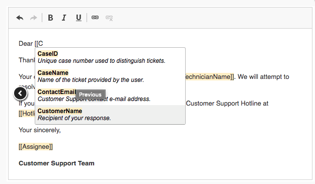

<div align="center">
  <a href="https://summerofcode.withgoogle.com" target="blank"></a>
</div>
<br></br>
<p align="center">
  
</p>
<br></br>
<br></br>
<br></br>


# GPT Integration to Generate/Improve Page Content in XWiki

Fengnan Sonia Sun |
fengnans@uci.edu |
[https://soniasun810.github.io/](https://soniasun810.github.io/)
<br></br>

**Table of Contents**
+ [1. Abstract](#1-abstract)
  + [1.1 How to Implement](#11-how-to-implement)
  + [1.2 Deliverables](#12-deliverables)
+ [2. Project Background](#2-project-background)
  + [2.1 About XWiki](#21-about-xwiki)
  + [2.2 Benefits of This Project](#22-benefits-of-this-project)
+ [3. Fine-tuning of OpenAI Model](#3-fine-tuning-of-openai-model)
  + [3.1 Implementation of Fine-tuning](#31-implementation-of-fine-tuning)
  + [3.2 Evaluate the Tuned Model](#32--evaluate-the-tuned-model)
+ [4. Use additional CKEditor plugins](#4-use-additional-ckeditor-plugins)
  + [4.1 CKEditor Autocomplete Plugin](#41-ckeditor-autocomplete-plugin)
  + [4.2 CKEditor UIButton Plugin](#42-ckeditor-uibutton-plugin)
+ [5. Summary](#5-summary)


----
<p style="page-break-after:always"></p>

# 1. Abstract

This proposal, initiated by mentor [Vincent Massol](https://www.xwiki.org/xwiki/bin/view/XWiki/VincentMassol) in the 2023 Google Summer of Code, seeks to integrate the GPT model into the XWiki platform to provide tools for improving and generating text on its pages.

## 1.1 How to Implement

To prepare this proposal, I implemented the training process on Curie model and used the fine-tuned model to add features to my portfolio website following the guides of [fine-tuning](https://platform.openai.com/docs/guides/fine-tuning). I tried to use XWiki [online](https://proposal2023soniasun.demo.xwiki.com/xwiki/bin/view/Main/) and thought about how to integrate this new feature into its current UI. **Here are steps to implement this project**:

- Select an affordable pre-trained OpenAI model and **fine-tune** it using **Python**. Alternatively, use the text-davinci-003 model directly for the new feature.
- Design **UI/UX** for the new feature that generates or improves page content in XWiki. Specifically, add UI button on editor toolbar to call GPT model to provide suggestion.
- Add the functionality by developing new additional **CKEditor plugins** and integrating the plugins into  [WYSIWYG editor](https://extensions.xwiki.org/xwiki/bin/view/Extension/CKEditor%20Integration/).
- In the plugin, call OpenAI API to leverage our tuned model to generate or improve page content using the [Java](https://github.com/TheoKanning/openai-java) library.

Setting up the new feature with integration of AI model can collectively bring several benefits to XWiki, including improved natural language processing capabilities, enhanced automation, increased productivity, improved user experience, expanded functionality, etc.

## 1.2 Deliverables

Here are some deliverables for the GPT Integration project:

- A fine-tuned GPT model that can generate and improve page content in XWiki.
- Achieve one of UI options for using the GPT model: auto-complete in editing area and a button to call the model for specific functions.
- Integration of additional CKEditor plugins to support GPT functionality.
- A popup for displaying recommended text generated by the GPT model, which can be applied directly by the user.
- A well-documented and user-friendly interface for using the GPT integration.
- Thorough testing to ensure the integration is stable and meets performance requirements.

I am grateful to Google for offering this opportunity through the Summer of Code program, and to all the contributors of XWiki for creating such a remarkable platform. I am particularly interested in mentor Vincent Massol's proposal for integrating GPT to generate/improve page content in XWiki, and I am eager to contribute to this project. As a team player, **I am willing to collaborating with other programmers to do this project together**.
<p style="page-break-after:always"></p>

# 2. Project Background

## 2.1 About XWiki

[XWiki](https://www.xwiki.org/xwiki/bin/view/Main/WebHome) is an open-source software development platform based on the wiki principles, under the LGPL license. 

XWiki is a free and open-source wiki software platform written in **Java**. It allows users to create and manage content in a collaborative and organized manner. XWiki is designed to be extensible and offers a wide range of features, such as document versioning, access control, file attachments, and more.

XWiki also offers a range of extensions and plugins to extend its functionality, such as macros, scripts, and themes. The software is available under the LGPL (Lesser General Public License) and is maintained by a community of developers and contributors.

XWiki is used by many organizations for knowledge management, documentation, and collaboration, as well as for creating custom web applications. It is also used as a platform for building enterprise portals, intranets, and other web-based systems.

<p align="center">
  
</p>

<p style="page-break-after:always"></p>

## 2.2 Benefits of This Project

If we implement the proposed project to improve the natural language processing capabilities, enhance automation, and improve user experience on XWiki, there will be several benefits to the community. 

Firstly, by leveraging OpenAI's pre-trained models and fine-tuning them for XWiki, we can enable more accurate and efficient natural language processing, which can help users easily and quickly find the information they need. This will save time and effort, improving productivity and engagement on the platform.

Secondly, by designing a user-friendly UI/UX and developing new CKEditor plugins, we can make XWiki more accessible and easier to use for everyone. This will help attract more users to the platform, and increase the adoption rate, resulting in a larger community of users and contributors. Additionally, by making the platform more user-friendly, we can encourage non-technical users to start contributing to open source, thus expanding the pool of potential contributors.

Finally, by implementing this project, we can demonstrate the power and potential of open source collaboration and innovation. By leveraging the power of open source software and community-driven development, we can create a cutting-edge platform that can compete with proprietary solutions. This will not only benefit the XWiki community but the open source community as a whole, as it will showcase the power of collaboration and innovation that is at the core of the open source movement. Overall, this project has the potential to benefit the community in many ways, from improving productivity and engagement to expanding the pool of potential contributors and demonstrating the power of open source collaboration.

# 3. Fine-tuning of OpenAI Model

[GPT-3](https://platform.openai.com/docs/models/gpt-3) models can understand and generate natural language. These models were superseded by the more powerful GPT-3.5 generation models. However, the original GPT-3 base models (**`davinci`**, **`curie`**, **`ada`**, and **`babbage`**) are currently the only models that are available to fine-tune. After comparing the property and pricing of these four models, I chose **curie** to build a fine-tuning model.

| Model Name | Description | Max  | Training Date |
| --- | --- | --- | --- |
| davinci | Most capable GPT-3 model. Can do any task the other models can do, often with higher quality. | 2,049 tokens | Up to Oct 2019 |
| curie | Very capable, but faster and lower cost than Davinci. | 2,049 tokens | Up to Oct 2019 |
| babbage | Capable of straightforward tasks, very fast, and lower cost. | 2,049 tokens | Up to Oct 2019 |
| ada | Capable of very simple tasks, usually the fastest model in the GPT-3 series, and lowest cost. | 2,049 tokens | Up to Oct 2019 |
<p style="page-break-after:always"></p>

## 3.1 Implementation of Fine-tuning

Following the guides on the OpenAI official website, I tuned a Curie model using a small-scale dataset.

- Install the necessary libraries, OpenAI API client library;
- Prepare the dataset, this includes cleaning and formatting your data to fit the input requirements (JSONL file) of the Curie model.
- Fine-tune the Curie model using Python. This involves using the OpenAI API to send my data to the Curie model for training. During the fine-tuning process, the model will update its parameters to better fit my specific use case.

I successfully tuned a Curie model with my dataset. However, it is not a free process. Considering that obtaining a powerful natural language processing and generating model requires a large-scale dataset, the cost of fine-tuning a model can be high.

```jsx
➜  AITuning openai api fine_tunes.follow -i <YOUR_FINE_TUNE_JOB_ID>
[2023-04-03 11:52:18] Created fine-tune: ft-Avj4ugdxmFJ0i2dri8PnHvFs
[2023-04-03 11:56:07] Fine-tune costs $0.01
[2023-04-03 11:56:08] Fine-tune enqueued. Queue number: 2
[2023-04-03 11:56:27] Fine-tune is in the queue. Queue number: 1
[2023-04-03 11:57:28] Fine-tune is in the queue. Queue number: 0
[2023-04-03 11:58:22] Fine-tune started
[2023-04-03 11:59:21] Completed epoch 1/4
[2023-04-03 11:59:22] Completed epoch 2/4
[2023-04-03 11:59:22] Completed epoch 3/4
[2023-04-03 11:59:23] Completed epoch 4/4
[2023-04-03 11:59:43] Uploaded model: curie:ft-personal-2023-04-03-18-59-43
[2023-04-03 11:59:44] Uploaded result file: file-5xzPy9g1DXp3C3vAU01m3e52
[2023-04-03 11:59:44] Fine-tune succeeded

Job complete! Status: succeeded 🎉
Try out your fine-tuned model:

openai api completions.create -m curie:<fine_tuned_model> -p <YOUR_PROMPT>
```

## 3.2  Evaluate the Tuned Model

I installed the aWe Node.js library and used my fine-tuned Curie model by calling the OpenAI [API](https://platform.openai.com/docs/api-reference/files).

```jsx
$ npm install openai
```

```jsx
const { Configuration, OpenAIApi } = require("openai");
const configuration = new Configuration({
  apiKey: process.env.OPENAI_API_KEY,
});
const openai = new OpenAIApi(configuration);
const response = await openai.createCompletion({
  model: <fine_tuned_model>,
  prompt: "Say this is a test",
  temperature: 0,
  max_tokens: 7,
});
```

Unfortunately, when comparing the performance of the tuned Curie model to the GPT-3.5 model text-davinci-003, it became apparent that the Curie model is much less capable of performing language tasks. This is due to a lack of high amounts of training data.

The text-davinci-003 model outperforms the curie model in any language task by providing better quality, longer output, and consistent instruction-following. It also supports [inserting](https://platform.openai.com/docs/guides/completion/inserting-text) completions within text. Therefore, I recommend using **text-davinci-003** directly in our new feature, unless we prepare enough training data to improve curie's performance or use the more expensive davinci model for fine-tuning purposes.

# 4. Use additional CKEditor plugins

There are many more [CKEditor plugins](http://ckeditor.com/addons/plugins/all) available that we can integrate separately in XWiki. After claim the plugins’ URL/path in CKEditor, and enable the plugins in the CKEditor configuration, we can add new functionality to customized CKEditor.  I believe that integrating the GPT model and our new feature into XWiki through additional CKEditor plugins would be a convenient and practical approach.

There are two potential ways to implement the GPT model functionality on the XWiki UI. The first is to add an **auto-complete feature** within the editing area, which can suggest or complete content based on the GPT model's predictions. The second approach is to add a **UI button that calls the GPT model** for specific functions, such as generating summaries or expanding content.

To demonstrate these implementation options, I have identified two existing plugins that could serve as inspiration: the CKEditor [Autocomplete Plugin](https://ckeditor.com/cke4/addon/autocomplete) and the [CKEditor Button Plugin](https://ckeditor.com/cke4/addon/button). Both of these plugins could be modified and integrated into the XWiki WYSIWYG editor to achieve the desired functionality.

## 4.1 CKEditor Autocomplete Plugin

This plugin provides contextual completion feature for custom text matches based on user input. Every time the user types a pre-configured matching character, such as "@" or "#", they get information about available autocomplete options. It includes the following features:

- Customization of the text matching function.
- Asynchronous data feed.
- Templating system for both the dropdown options and accepted output.
- Throttling to reduce text check frequency. \
Please refer source code: [https://github.com/ckeditor/ckeditor4/blob/master/plugins/autocomplete/plugin.js](https://github.com/ckeditor/ckeditor4/blob/master/plugins/autocomplete/plugin.js)


<p align="center">
  
</p>


## 4.2 CKEditor UIButton Plugin

This plugin provides an UI [button](https://docs.ckeditor.com/#!/api/CKEDITOR.ui.dialog.button) component that other plugins use to register buttons on editor toolbar and menu, it's not providing any concrete editor feature. This is an official plugin provided and supported by CKEditor developers.

Please refer source code:
[https://github.com/ckeditor/ckeditor4/blob/master/plugins/button/plugin.js](https://github.com/ckeditor/ckeditor4/blob/master/plugins/button/plugin.js)

When the user select piece of text, and click the button “improve” or “generate” on toolbar, the GPT model could provide suggestions for completing or modifying the text. These suggestions could be displayed in a popup or dropdown menu within the editing area, allowing the user to select and apply them directly. This would help streamline the editing process and make it easier for users to create high-quality content.

# 5. Summary

My project proposal for XWiki involves integrating an AI-powered language model into the platform's editing interface to help users create high-quality content more easily and efficiently. I am passionate about this project because I believe that it has the potential to revolutionize the way that users interact with XWiki, making it easier and more intuitive to create and edit content.

My goal for this project is to develop a customized language model based on OpenAI's Curie architecture, fine-tuned to understand the specific needs and requirements of XWiki users. I also plan to design a user-friendly interface that makes it easy to access the model's features and apply its recommendations to the editing process. Finally, I aim to integrate the model into XWiki's existing CKEditor WYSIWYG editor using custom plugins, allowing users to seamlessly incorporate its capabilities into their workflows.

Overall, I believe that this project has the potential to benefit the XWiki community and the open-source community as a whole by making it easier for users to create high-quality content with minimal effort. I am excited to take on this challenge and look forward to making a meaningful contribution to the XWiki platform.